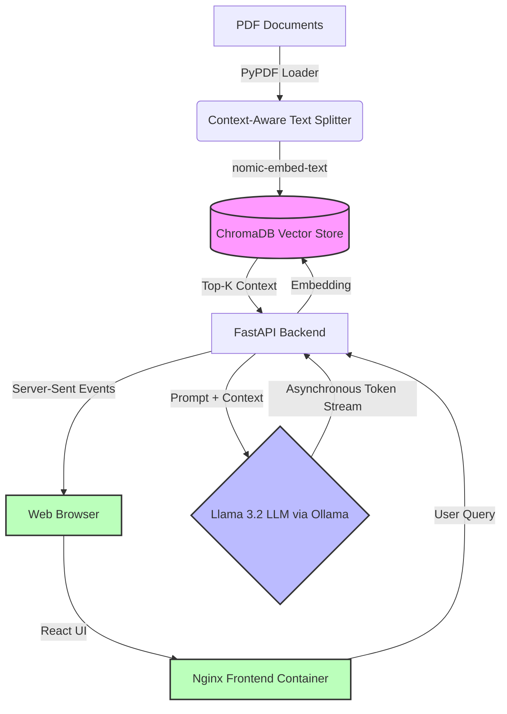

An offline, air-gapped Retrieval-Augmented Generation (RAG) pipeline with a real-time streaming UI. Designed to enable semantic querying over sensitive documents without risking data egress to external cloud providers.

Built to run entirely locally using **Llama 3.2**, **FastAPI**, **React**, and **ChromaDB**, with hardware-accelerated inference containerized via Docker.

## 🏗 System Architecture


🚀 Key Engineering Decisions & Metrics
100% Data Sovereignty: Decoupled the inference engine to run Llama locally via Ollama. Zero data leaves the host machine, ensuring absolute compliance for sensitive property and legal documents.

Asynchronous Token Streaming: Overhauled the FastAPI backend and React client to utilize StreamingResponse and the native TextDecoder API. This eliminated the LLM pre-fill latency block, reducing Time-To-First-Token (TTFT) to milliseconds and dramatically improving perceived performance.

Full-Stack Containerization: Engineered a multi-stage Docker build for the React frontend, compiling the Vite application down to static assets served by a lightweight Nginx web server, networked securely to the API layer.

Quantifiable Accuracy Gains: Engineered a synthetic benchmarking suite (/benchmarks/accuracy_eval.py) comparing standard BM25 keyword search against ChromaDB vector embeddings. The vector pipeline demonstrated an 80% improvement in retrieval hit rate on complex contextual queries.

Optimized Inference Latency: Achieved sub-200ms vector retrieval times from the local ChromaDB instance. Configured NVIDIA GPU passthrough in Docker Compose and right-sized the LLM to Llama 3.2 (1B), reducing median full-cycle generation latency by over 60% compared to baseline 8B models.

🛠 Tech Stack
Frontend: React, Vite, TailwindCSS, Nginx

Backend: Python 3.11, FastAPI, LangChain

Database: ChromaDB (Local Vector Store)

Inference: Ollama (Llama 3.2 1B, nomic-embed-text)

Infrastructure: Docker, Docker Compose (Multi-stage builds, GPU acceleration)

⚙️ Quick Start
1. Clone the repository and install backend dependencies:

```bash
git clone [https://github.com/hitaanshjain/local-rag-search-engine.git](https://github.com/hitaanshjain/local-rag-search-engine.git)
cd local-rag-search-engine
uv sync
```
2. Add your data:
Place any PDF documents you want the model to read into the /data directory.

3. Boot the full-stack containerized engine:
Ensure Docker Desktop is running and configured for GPU passthrough if available.

```bash
docker compose up -d --build
```
4. Ingest and vectorize the data:

```bash
uv run python -m app.ingest
```
5. Access the Web UI:
Open your browser and navigate to: http://localhost:3000