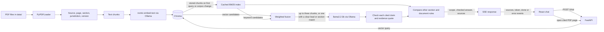

# Local RAG Search Engine

This project answers questions about PDFs using local Ollama models. FastAPI retrieves relevant chunks from Chroma, checks generated claims against their cited passages, compares competing rules, and sends the answer with file, PDF page, and passage excerpts to a React chat UI.

The model and embedding requests are configured for a local Ollama service. Initial image and model downloads require network access; the application does not enforce network isolation or prove that a deployment is air-gapped.

## How it works


```mermaid
flowchart LR
    PDFs[PDF files in data/] --> Load[PyPDFLoader]
    Load --> Stamp[Source, page, section, jurisdiction, version]
    Stamp --> Split[Text chunks]
    Split --> Embed[nomic-embed-text via Ollama]
    Embed --> DB[(Chroma)]
    Browser[React chat] -->|POST /chat| API[FastAPI]
    API -->|vector query| DB
    DB -->|stored chunks on first query or corpus change| BM25[Cached BM25 index]
    DB -->|vector candidates| Fuse[Weighted fusion]
    BM25 -->|keyword candidates| Fuse
    Fuse -->|up to three chunks, or one with a clear lead or section match| LLM[llama3.2:3b via Ollama]
    LLM --> Verify[Check each cited claim and evidence quote]
    BM25 --> Compare[Compare other section and document rules]
    Verify --> Compare
    Compare -->|scope, checked answer, sources| SSE[SSE response]
    SSE -->|sources, token, done or error events| Browser
    Browser -->|open cited PDF page| API
```

Ingestion reads the PDFs in `data/`, assigns `source` and one-based `page` metadata, carries numbered section headings onto following chunks, and extracts jurisdiction and document version from title material when available. Re-running ingestion uses stable chunk IDs, updates changed chunks, and removes chunks absent from the current PDFs. After a successful corpus change, it atomically writes `chroma_db/index.version`, retrying transient Windows permission errors when replacing the marker. The API caches the BM25 index and rebuilds it only when that version changes. Reingest existing PDFs to add scope metadata to an older index. The generated `chroma_db/` directory is ignored by Git.

For a chat query, Chroma supplies vector candidates and `rank-bm25` scores the stored chunk corpus. Queries naming a section code use section headings and match codes such as `R-2` as whole terms; other queries retain the ordinary BM25 index. Retrieval combines normalized vector and BM25 scores at **0.25 vector / 0.75 BM25** by default, ranks **chunks**, and keeps keyword-only hits. `/chat` uses up to three retrieved chunks as context. When the top BM25 passage has a clear lead, or matches an explicitly named section, and is the top fused result, it sends that passage alone to reduce conflicting context for the small model. When two different source files match a broad question nearly equally, it asks which city or document the user means. Retrieval runs in a thread pool so its synchronous Chroma and BM25 work does not block the API event loop.

The API sends valid server-sent event frames over its POST response:

```text
event: sources
data: {"sources":[{"source":"zoning.pdf","page":4,"excerpt":"..."}]}

event: token
data: {"text":"Answer text [1]."}

event: done
data: {}

```

An empty search sends the same event types, with an empty sources array and an abstention message. A generation or checking failure sends a terminal `error` event. The React client reads the response with `fetch`, `ReadableStream.getReader()`, and `TextDecoder`; it shows numbered sources, excerpts, and links to `/documents/{filename}#page=N`. The UI can stop a response with `AbortController`.

The API buffers the draft before sending any answer text. It checks each cited claim against its cited passage using the local model and requires an evidence excerpt present in that passage. An unsupported citation may be reassigned only after the other passage is checked. If the first draft cannot be verified, a shorter extractive draft gets the same check; the API abstains if neither passes. It compares distinct retrieved pages in the same jurisdiction for differing rules, requires quoted evidence from both sides, and asks for clarification when the applicable jurisdiction, district, or version cannot be chosen. For differing numeric limits, it also compares rule sentences about the question's subject. The answer identifies jurisdiction, district, document version, and source using ingested metadata; missing fields say so explicitly. These checks reduce unsupported output but still depend partly on a small model and retrieved coverage. `Server-Timing` reports total retrieval plus index, vector, keyword, fusion, ambiguity, and context-selection stages. The `/chat` response also includes `X-LLM-Model` with the configured model name, which the answer evaluator records alongside its results.

## Measured retrieval accuracy

The [retrieval results](benchmarks/results.md) and [raw results](benchmarks/results.json) cover the five checked-in PDFs: **1,070 physical pages and 3,639 stored chunks**. The development set has **28 questions**: 20 original replacements and eight additional questions. Each answerable label has an excerpt checked against its physical PDF page; one question has two verified pages. The [query-change record](benchmarks/results.md#query-changes) also lists the 50 removed queries from the earlier mislabeled set. These labels do not enumerate every relevant page, and the additional questions were used during development.

| Method | Source hit@3 | Source hit@5 | Source MRR | Page hit@3 | Page hit@5 | Page MRR |
|---|---:|---:|---:|---:|---:|---:|
| Vector only | 96.4% | 100.0% | 0.954 | 82.1% | 89.3% | 0.718 |
| Substring keyword baseline | 75.0% | 85.7% | 0.736 | 64.3% | 71.4% | 0.550 |
| BM25 keyword only | 100.0% | 100.0% | 1.000 | 89.3% | 92.9% | 0.866 |
| Hybrid with substring baseline | 85.7% | 89.3% | 0.846 | 71.4% | 75.0% | 0.668 |
| Hybrid, 0.25 vector / 0.75 BM25 | 100.0% | 100.0% | 1.000 | 92.9% | 92.9% | 0.851 |
| Hybrid, 0.50 vector / 0.50 BM25 | 100.0% | 100.0% | 1.000 | 89.3% | 92.9% | 0.795 |
| Hybrid, 0.75 vector / 0.25 BM25 | 100.0% | 100.0% | 1.000 | 85.7% | 92.9% | 0.798 |

The 0.25/0.75 blend had higher page hit@3 than the 0.50/0.50 blend on this set; BM25 alone still had slightly higher page MRR. Hit@k checks retrieved chunks against the labeled file or file/page pair; MRR uses the first matching rank. The small development set does not establish performance on other documents or questions.

## Measured answer quality

The [development answer results](benchmarks/development_answer_results.md) passed **9/12** screening checks with claim verification enabled, down from 10/12 before that check. One answerable item abstained, one cited a different page that states the same numeric limit but is outside the labeled pages, and one gave a different appeal answer than the label. The [former final holdout, now used as a regression set](benchmarks/answer_results.md) passed **10/10**. Its Union City R-2 guest-house answer states 900 square feet, cites the R-2 passage on physical PDF page 54, and explains the differing 700-square-foot heated and finished area rule on page 38. This set is no longer an untouched holdout. It includes two questions outside the PDFs and one underspecified setback question; all three received the expected abstention or clarification.

Answerable checks require an accepted answer phrase and a citation to a verified page. They catch some wrong facts and citations, but phrase matching cannot prove that every sentence is supported. The stricter gate can also reject valid paraphrases. The [raw final answers](benchmarks/answer_results.json) are retained for review.

## Measured response latency

The [latency results](benchmarks/latency_results.md) and [raw samples](benchmarks/latency_results.json) record five fixed questions with two measured requests each, after one excluded warmup request. Ollama reported `llama3.2:3b` running on a **GPU**. Times below are measured from the HTTP client; retrieval stages are measured inside the API for the same request.

| Metric | Median | P90 |
|---|---:|---:|
| Retrieval | 215.6 ms | 227.8 ms |
| Cached index check | 6.7 ms | 7.7 ms |
| Vector query | 165.9 ms | 181.0 ms |
| BM25 query | 16.6 ms | 19.4 ms |
| Time to answer text | 1,884.8 ms | 3,587.2 ms |
| Full response | 1,884.8 ms | 3,587.2 ms |

The answer is sent after generation, citation verification, and conflict comparison, so time to answer text now nearly equals full response time. The earlier pre-verification run measured 313.4 ms median time to first token and 775.0 ms median full response on the same five fixed questions. This is a ten-request local GPU sample, not a general throughput claim.

## Requirements and setup

- Python 3.13 and [uv](https://docs.astral.sh/uv/)
- Docker Desktop with NVIDIA GPU support for the supplied Compose file

```powershell
uv sync
docker compose up -d ollama
docker compose exec ollama ollama pull llama3.2:3b
docker compose exec ollama ollama pull nomic-embed-text
```

Place PDFs in `data/`, then ingest them from the host while the Compose Ollama service is running. Start the API and UI after ingestion:

```powershell
uv run python -m app.ingest
docker compose up -d --build
```

Open `http://localhost:3000`. The frontend, backend, and Ollama ports bind to `127.0.0.1` by default. Compose mounts `data/` read-only into the backend so PDF page links continue to work after adding documents and reingesting. The API permits the `http://localhost:3000` browser origin by default; another origin requires `FRONTEND_ORIGIN` in the backend container environment. `LLM_MODEL` can override the default `llama3.2:3b` model in Compose. There is no authentication or TLS, so this configuration is for local use. The supplied Compose file reserves an NVIDIA GPU; it has no automatic CPU fallback.

## Reproducing the checks

```powershell
uv run python -m unittest discover -s tests -v
uv run python -m benchmarks.accuracy_eval
uv run python -m benchmarks.answer_eval --dataset development_queries.json --output-prefix development_answer_results
uv run python -m benchmarks.answer_eval
uv run python -m benchmarks.latency_test
```

Run the answer and latency commands after `docker compose up -d --build`, since they call the live `/chat` endpoint. For the frontend, run `npm ci`, `npm test`, `npm run lint`, and `npm run build` from `frontend/`.

## License

[MIT](LICENSE)
