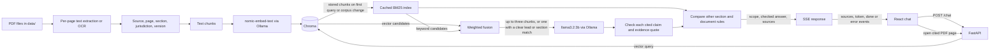

# Local RAG Search Engine

This project answers questions about PDFs using local Ollama models. FastAPI retrieves relevant chunks from Chroma, checks generated claims against their cited passages, compares competing rules, and sends the answer with file, PDF page, and passage excerpts to a React chat UI.

The model and embedding requests are configured for a local Ollama service. Initial image and model downloads require network access; the application does not enforce network isolation or prove that a deployment is air-gapped.

## How it works


```mermaid
flowchart LR
    PDFs[PDF files in data/] --> Load[Per-page text extraction or OCR]
    Load --> Stamp[Source, page, section, jurisdiction, version]
    Stamp --> Split[Text chunks]
    Split --> Embed[nomic-embed-text via Ollama]
    Embed --> DB[(Chroma)]
    Browser[React chat] -->|POST /chat| API[FastAPI]
    API -->|vector query| DB
    DB -->|stored chunks on first query or corpus change| BM25[Cached BM25 index]
    DB -->|vector candidates| Fuse[Weighted fusion]
    BM25 -->|keyword candidates| Fuse
    Fuse -->|up to three chunks, or one with a clear lead or section match| LLM[llama3.2:3b via Ollama]
    LLM --> Verify[Check each cited claim and evidence quote]
    BM25 --> Compare[Compare other section and document rules]
    Verify --> Compare
    Compare -->|scope, checked answer, sources| SSE[SSE response]
    SSE -->|sources, token, done or error events| Browser
    Browser -->|open cited PDF page| API
```

Ingestion reads the PDFs in `data/`, assigns `source` and one-based `page` metadata, labels chunks by their section heading (`6-15 TCMU…`, `Sec. 54-269.…`, or `APPENDIX C`), and extracts jurisdiction and document version from title material when available. Numbered lines that start lowercase, start with a year, or end in table-of-contents dot leaders are not treated as headings, and a "Place, State" line counts as a jurisdiction only when the state is a US state. Re-running ingestion uses stable chunk IDs, updates changed chunks, and removes chunks absent from the current PDFs. After a successful corpus change, it atomically writes `chroma_db/index.version`, retrying transient Windows permission errors when replacing the marker. The API caches the BM25 index and rebuilds it only when that version changes. The generated `chroma_db/` directory is ignored by Git.

For a chat query, Chroma supplies vector candidates and `rank-bm25` scores the stored chunk corpus. Queries naming a section code use section headings and match codes such as `R-2` as whole terms; other queries retain the ordinary BM25 index. Retrieval combines normalized vector and BM25 scores at **0.25 vector / 0.75 BM25** by default, ranks **chunks**, and keeps keyword-only hits. `/chat` uses up to three retrieved chunks as context. When the top BM25 passage has a clear lead, or matches an explicitly named section, and is the top fused result, it sends that passage alone to reduce conflicting context for the small model. When two different source files match a broad question nearly equally, it asks which city or document the user means. Retrieval runs in a thread pool so its synchronous Chroma and BM25 work does not block the API event loop.

Extraction reads each PDF page with PyMuPDF and uses RapidOCR when its native text is weak. It keeps the more complete result, writes each detected table row as column-labeled pairs (`Zone: P; Required yards Front: 10 ft. …; Required yards Side: none`) so a row stays readable in any chunk, keeps ruled tables however many cells are empty so a value stays in its column, and preserves recognized section headings as chunk boundaries. Pages without a detected table keep the PDF's drawing order, because sorting a borderless table's text by position scatters each row. Charleston page footers such as `4-20.1 Supp. No. 6` are not treated as headings. A page with no text, images, or drawings is recorded as intentionally blank and skips OCR. Ingestion writes `chroma_db/pages.json` with each PDF's page count, blank pages, and pages that stayed unreadable after both methods; the ingestion log and `GET /documents` report the unreadable ones, and neither kind produces a chunk. OCR and complex table layout are best effort; check the cited PDF for uncertain passages. Re-run ingestion to apply this extraction to existing PDFs.

The browser saves conversation turns and the selected PDF names locally when the browser allows it; blocked or full storage only loses that history. It sends recent turns with each follow-up. The API asks the model to rewrite the follow-up as a standalone search query and keeps the rewrite only if it retains every content word of the latest question and adds at most one word absent from the conversation; otherwise it searches a complete question as asked, or pairs a short one with the previous question. When a follow-up names a place its previous question did not, district codes and other places carried over from earlier turns are removed from the search query, since a code such as R-2 belongs to one jurisdiction: after a Union City R-2 guest-house question, "And in Charleston?" searches for Charleston guest-house rules. Place names come from the ingested jurisdictions. That search still abstains, because Charleston's ordinance calls these accessory dwelling units and retrieval does not map one term to the other. Answer claims remain tied to retrieved passages. Users can select one or more indexed PDFs; keyword search scores the whole corpus and then keeps only the selected PDFs, so scores and thresholds do not depend on the selection, and vector search and conflict comparison use the same selection. **New conversation** clears the turns and stops an in-progress response. The API itself is stateless, and query-only requests still search all indexed PDFs.

The API sends valid server-sent event frames over its POST response:

```text
event: status
data: {"stage":"searching","text":"Searching the selected documents…"}

event: status
data: {"stage":"drafting","text":"Drafting an answer…"}

event: status
data: {"stage":"checking","text":"Checking each claim against its cited passage…"}

event: status
data: {"stage":"comparing","text":"Comparing related rules…"}

event: sources
data: {"sources":[{"source":"zoning.pdf","page":4,"excerpt":"..."}]}

event: token
data: {"text":"Answer text [1]."}

event: timing
data: {"index_ms":5.6,"rewrite_ms":0.0,"retrieval_ms":209.2,"vector_ms":147.7,"keyword_ms":15.2,"fusion_ms":0.1,"ambiguity_ms":18.3,"context_ms":16.0,"draft_ms":812.4,"check_ms":0.3,"conflict_ms":402.9,"answer_ms":1290.6,"drafts":1,"check_calls":1}

event: done
data: {}

```

`status` events mark each stage as it starts, and the UI shows the latest one until the answer arrives; `searching` is sent first, before any follow-up rewrite or retrieval, and a retry repeats `drafting` and `checking`. `timing` reports the stages for that request: the cached index check, follow-up rewrite, retrieval (with its vector, keyword, fusion, ambiguity, and context-selection parts), all drafts, claim checks and citation repair, conflict search and comparison, the total from drafting to the answer, the number of drafts, and the model calls made outside drafting. A clarification or an empty search sends `searching`, then `sources`, `token`, `timing`, and `done`.

An empty search sends an empty sources array and an abstention message. A search, generation, or checking failure sends a terminal `error` event; only an invalid document selection returns an HTTP error (422). The React client reads the response with `fetch`, `ReadableStream.getReader()`, and `TextDecoder`; it shows numbered sources, excerpts, and links to `/documents/{filename}#page=N`. The UI can stop a response with `AbortController`.

The API buffers the draft before sending any answer text. It checks each cited claim against its cited passage. A claim is confirmed without a model call when one sentence of the passage contains all of the claim's numbers, any district or section codes it names, and all of its content words, including at least one word naming what is measured; that sentence must also have the same negation words and contain any limit words the claim uses, such as "minimum", "maximum", or "exceed". Every other claim goes to the local model, which must return an evidence excerpt present in that passage. An unsupported citation may be reassigned only after the other passage is checked. If the first draft cannot be verified, a shorter extractive draft gets the same check; the API abstains if neither passes. It compares distinct retrieved pages in the same jurisdiction for differing rules, requires quoted evidence from both sides, and asks for clarification when the applicable jurisdiction, district, or version cannot be chosen. When the question names the other passage's section, jurisdiction, or version, the answer quotes that passage's rule instead of the draft. For differing numeric limits, it also compares rule sentences about the question's subject. The answer identifies jurisdiction, district, document version, and source using ingested metadata; missing fields say so explicitly. These checks reduce unsupported output but still depend partly on a small model and retrieved coverage; the model-based conflict check can also flag rules for different tiers of the same use (for example, developments with fewer than twenty units versus twenty or more) as conflicting. The `/chat` response also includes `X-LLM-Model` with the configured model name, which the answer evaluator records alongside its results.

## Measured retrieval accuracy

The [retrieval results](benchmarks/results.md) and [raw results](benchmarks/results.json) cover the five checked-in PDFs: **1,070 physical pages and 4,854 stored chunks** (section-aware chunks from the per-page extractor; the 85 blank Charleston pages produce none). The development set has **28 questions**: 20 original replacements and eight additional questions. Each answerable label has an excerpt checked against its physical PDF page; one question has two verified pages. The [query-change record](benchmarks/results.md#query-changes) also lists the 50 removed queries from the earlier mislabeled set. These labels do not enumerate every relevant page, and the additional questions were used during development.

| Method | Source hit@3 | Source hit@5 | Source MRR | Page hit@3 | Page hit@5 | Page MRR |
|---|---:|---:|---:|---:|---:|---:|
| Vector only | 96.4% | 96.4% | 0.851 | 67.9% | 75.0% | 0.593 |
| Substring keyword baseline | 67.9% | 75.0% | 0.637 | 57.1% | 64.3% | 0.506 |
| BM25 keyword only | 100.0% | 100.0% | 1.000 | 82.1% | 89.3% | 0.780 |
| Hybrid with substring baseline | 78.6% | 78.6% | 0.762 | 71.4% | 71.4% | 0.643 |
| Hybrid, 0.25 vector / 0.75 BM25 | 100.0% | 100.0% | 1.000 | 89.3% | 92.9% | 0.817 |
| Hybrid, 0.50 vector / 0.50 BM25 | 100.0% | 100.0% | 1.000 | 89.3% | 92.9% | 0.811 |
| Hybrid, 0.75 vector / 0.25 BM25 | 96.4% | 96.4% | 0.964 | 75.0% | 82.1% | 0.744 |

Compared with the earlier PyPDF chunks, the production blend keeps page hit@5 at 92.9% but has page hit@3 of 89.3% (92.9% before) and page MRR of 0.817 (0.851 before). The loss is one Los Angeles summary question (`sum_03`, CR maximum height), whose labeled page now ranks fifth: every row of that summary now carries its column labels, so a question about maximum height matches rows on every page. That is the cost of writing table rows with their column labels, which fixed an answer: with the table's columns flattened, the model read the side-yard "none" as the front yard for surface parking. Flattened text had page hit@3 of 92.9% and MRR 0.869; Markdown table rows had 89.3% and 0.774. The labeled rows also cost the single-method rankings: vector-only page hit@3 is 67.9% (75.0% with flattened tables, 82.1% with PyPDF) and BM25-only is 82.1% (89.3%), losing the Los Angeles summary questions and one Charleston question. The first per-page extractor had dropped vector-only page hit@3 to 67.9%: it sorted text blocks by position, which scattered each row of borderless tables, and it split chunks at Charleston page footers (`4-20.1 Supp. No. 6`) mistaken for section headings, labeling 1,804 chunks with a footer. Merging chunks under 400 characters within a page did not change any question's result, so it was not kept. Hit@k checks retrieved chunks against the labeled file or file/page pair; MRR uses the first matching rank. The small development set does not establish performance on other documents or questions.

## Measured answer quality

Three question sets are used, and only the first two may guide changes:

- **Development** ([`development_queries.json`](benchmarks/development_queries.json), 12 items). The [results](benchmarks/development_answer_results.md) passed **10/12** screening checks on the current index. The Los Angeles front-yard question answers 10 ft for surface parking combined with an A or R zone; before table rows kept their column labels, it said no front yard was required, having read the side-yard "none" as the front yard, and that claim passed the model check. The Union City cemetery answer (ten acres) is correct but cites page 100, which states the same rule for another district and is not a labeled page. The sidewalk-cafe appeal question gave a different appeal answer than the label. The Charleston monument-sign question passes; on the index with footer headings it was answered with a clarification because the conflict check treated the rule for fewer than twenty business units as conflicting with the rule for twenty or more.
- **Regression** ([`regression_queries.json`](benchmarks/regression_queries.json), 10 items). This was the final holdout until the claim-verification and conflict changes were tuned against its Union City R-2 miss, so it no longer measures unseen questions. The [results](benchmarks/regression_answer_results.md) passed **9/10**. The R-2 guest-house answer states 900 square feet, cites physical PDF page 54, and explains the differing 700-square-foot heated and finished area rule on page 38. The miss is the Charleston sign-face question: the answer states the labeled ten percent limit but cites page 496, the rule for ground-floor businesses in multi-story buildings, rather than the general façade rule on labeled page 506. The Charleston home-occupation answer ("the maximum number of nonresident employees is one") now counts as a match after that phrasing was added to its accepted answers. Its two questions outside the PDFs and its underspecified setback question received the expected abstention or clarification. Results recorded before the rename still name the dataset `heldout_queries.json`.
- **Final holdout** ([`heldout_queries.json`](benchmarks/heldout_queries.json), 26 items, not yet run). Written on September 26, 2026 after the regression set was spent. Answerable pages were drawn with `random.Random(20260926)`, four per PDF, skipping pages used by the other sets, pages under 600 characters, and table-of-contents pages. Pages were skipped only when no unambiguous answer could be labeled: two Charleston amendment-history tables, an Urbana and an Issaquah use table whose columns do not survive text extraction, and a Los Angeles row where the phrase "5 acres" also matches "2.5 acres". Each evidence excerpt is checked against its physical page, and every other page containing the same excerpt is listed as an alternate. The four unanswerable questions are zoning near-misses (an impact-fee amount, chicken limits, rooftop solar setbacks, EV charger counts) confirmed absent by searching all extracted page text; the two ambiguous questions have different answers in different PDFs. A test checks that it shares no questions or answer pages with the development and regression sets.

Run the final holdout once, after the pipeline for a result is settled, and report that run. Do not change retrieval, prompts, or checks in response to its individual misses; if that becomes necessary, move it to the regression set and write a new holdout.

Answerable checks require an accepted answer phrase and a citation to a verified page. They catch some wrong facts and citations, but phrase matching cannot prove that every sentence is supported. The stricter gate can also reject valid paraphrases. Raw answers are retained in the matching `.json` files.

## Measured response latency

These measurements predate per-page extraction, follow-up rewriting, document selection, and the `searching` status, and have not been repeated since: a rerun on September 27, 2026 found another workload holding the GPU at about 70% utilization, which slowed every model step two to three times. The one change measurable under that contention is that the first `status` event now arrives before retrieval, in about 13 ms. Follow-up questions add one model call to rewrite the question.

The [latency results](benchmarks/latency_results.md) and [raw samples](benchmarks/latency_results.json) record five fixed questions with two measured requests each, after one excluded warmup request. Ollama reported `llama3.2:3b` running on a **GPU**. Times below are measured from the HTTP client; retrieval stages are measured inside the API for the same request.

| Metric | Median | P90 |
|---|---:|---:|
| Retrieval | 209.2 ms | 229.5 ms |
| Cached index check | 5.6 ms | 6.9 ms |
| Vector query | 147.7 ms | 183.4 ms |
| BM25 query | 15.2 ms | 22.6 ms |
| First status message | 227.9 ms | 256.1 ms |
| Time to answer text | 1,398.4 ms | 3,948.9 ms |
| Full response | 1,398.5 ms | 3,948.9 ms |
| Drafting (server) | 787.2 ms | 1,011.1 ms |
| Claim checks and repair (server) | 0.3 ms | 2,374.8 ms |
| Conflict comparison (server) | 353.5 ms | 433.9 ms |

The answer is sent after drafting, claim checks, and conflict comparison, so time to answer text nearly equals full response time; the first status message arrives right after retrieval. Before claims could be confirmed from passage text, the same five questions measured 2,008.3 ms median and 3,741.3 ms P90 time to answer text, with 765.6 ms median checking. Three of the five now pass the text check and skip that model call. The P90 comes from `cha_02`, whose claims need the model and citation repair (five check calls, about 2.4–2.8 s of checking), and the text check does not shorten that path. The earlier pre-verification streaming run measured 313.4 ms median time to first token. This is a ten-request local GPU sample, and repeated runs of unchanged drafting code varied by about 20%, so small differences are not meaningful.

Checks could also run concurrently, but the Compose Ollama service reports `OLLAMA_NUM_PARALLEL: 1` and would queue them. On the common path, only conflict comparison (about 0.35 s) remains after drafting, and it needs the finished draft, so concurrency was not added.

## Requirements and setup

- Python 3.13 and [uv](https://docs.astral.sh/uv/)
- Docker Desktop with NVIDIA GPU support for the supplied Compose file

```powershell
uv sync
docker compose up -d ollama
docker compose exec ollama ollama pull llama3.2:3b
docker compose exec ollama ollama pull nomic-embed-text
```

`uv sync` installs the `ingest` dependency group (PyMuPDF and RapidOCR) by default for host-side ingestion. The backend image installs with `--no-group ingest`, since the API never extracts PDFs.

Place PDFs in `data/`, then ingest them from the host while the Compose Ollama service is running. Start the API and UI after ingestion:

```powershell
uv run python -m app.ingest
docker compose up -d --build
```

Open `http://localhost:3000`. The frontend, backend, and Ollama ports bind to `127.0.0.1` by default. Compose mounts `data/` read-only into the backend so PDF page links continue to work after adding documents and reingesting. The API permits the `http://localhost:3000` browser origin by default; another origin requires `FRONTEND_ORIGIN` in the backend container environment. `LLM_MODEL` can override the default `llama3.2:3b` model in Compose. There is no authentication or TLS, so this configuration is for local use. The supplied Compose file reserves an NVIDIA GPU; it has no automatic CPU fallback.

## Reproducing the checks

```powershell
uv run python -m unittest discover -s tests -v
uv run python -m benchmarks.accuracy_eval
uv run python -m benchmarks.answer_eval --dataset development_queries.json --output-prefix development_answer_results
uv run python -m benchmarks.answer_eval --dataset regression_queries.json --output-prefix regression_answer_results
uv run python -m benchmarks.answer_eval  # final holdout: see the protocol above before running
uv run python -m benchmarks.latency_test
```

Run the answer and latency commands after `docker compose up -d --build`, since they call the live `/chat` endpoint. For the frontend, run `npm ci`, `npm test`, `npm run lint`, and `npm run build` from `frontend/`.

## License

[MIT](LICENSE)
