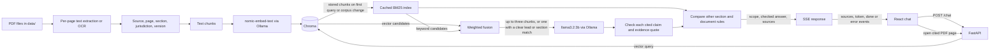

# Local RAG Search Engine

This project answers questions about PDFs using local Ollama models. FastAPI retrieves relevant chunks from Chroma, checks generated claims against their cited passages, compares competing rules, and sends the answer with file, PDF page, and passage excerpts to a React chat UI.

PDF extraction, OCR, embeddings, retrieval, and answer generation run locally. The application disables Chroma telemetry and loads bundled OCR models without a download fallback; the supplied Compose configuration disables Ollama cloud features. Its normal app network is internal, and the localhost-facing gateway removes its external route and sends external DNS to local loopback before serving requests. A claim that nothing leaves the machine also requires the host and browser to be disconnected from external networks.


## How it works


```mermaid
flowchart LR
    PDFs[PDF files in data/] --> Load[Per-page text extraction or OCR]
    Load --> Stamp[Source, page, section, jurisdiction, version]
    Stamp --> Split[Text chunks]
    Split --> Embed[nomic-embed-text via Ollama]
    Embed --> DB[(Chroma)]
    Browser[React chat] -->|POST /chat| API[FastAPI]
    API -->|vector query| DB
    DB -->|stored chunks on first query or corpus change| BM25[Cached BM25 index]
    DB -->|vector candidates| Fuse[Weighted fusion]
    BM25 -->|keyword candidates| Fuse
    Fuse -->|up to three chunks, or one with a clear lead or section match| LLM[llama3.2:3b via Ollama]
    LLM --> Verify[Check each cited claim and evidence quote]
    BM25 --> Compare[Compare other section and document rules]
    Verify --> Compare
    Compare -->|scope, checked answer, sources| SSE[SSE response]
    SSE -->|sources, token, done or error events| Browser
    Browser -->|open cited PDF page| API
```

Ingestion reads the PDFs in `data/`, assigns `source` and one-based `page` metadata, labels chunks by their section heading (`6-15 TCMU…`, `Sec. 54-269.…`, or `APPENDIX C`), and extracts jurisdiction and document version from title material when available. The heading pattern requires an uppercase letter after a short section number. Two specific cases are then excluded: a candidate line containing the literal sequence `. .` (a spaced table-of-contents leader) and Charleston page footers such as `4-20.1 Supp. No. 6`. Dot leaders in other forms, such as `....` without spaces, are not rejected. A "Place, State" line counts as a jurisdiction only when the state is a US state. Re-running ingestion uses stable chunk IDs, updates changed chunks, and removes chunks absent from the current PDFs. After a successful corpus change, it atomically writes `chroma_db/index.version`, retrying transient Windows permission errors when replacing the marker. The API caches the BM25 index and rebuilds it only when that version changes. The generated `chroma_db/` directory is ignored by Git.

For a chat query, Chroma supplies vector candidates and `rank-bm25` scores the stored chunk corpus. Queries naming a section code use section headings and match codes such as `R-2` as whole terms; other queries retain the ordinary BM25 index. Retrieval combines normalized vector and BM25 scores at **0.25 vector / 0.75 BM25** by default, ranks **chunks**, and keeps keyword-only hits. `/chat` uses up to three retrieved chunks as context. When the top BM25 passage has a clear lead, or matches an explicitly named section, and is the top fused result, it sends that passage alone to reduce conflicting context for the small model. When two different source files match a broad question nearly equally, it asks which city or document the user means. Retrieval runs in a thread pool so its synchronous Chroma and BM25 work does not block the API event loop.

Extraction reads each PDF page with PyMuPDF and uses RapidOCR when its native text is weak. It keeps whichever result has more alphanumeric characters, writes each detected table row as column-labeled pairs (`Zone: P; Required yards Front: 10 ft. …; Required yards Side: none`) so a row stays readable in any chunk, keeps ruled tables however many cells are empty so a value stays in its column, and preserves recognized section headings as chunk boundaries. Pages without a detected table keep the PDF's drawing order, because sorting a borderless table's text by position scatters each row. Charleston page footers such as `4-20.1 Supp. No. 6` are not treated as headings. A page with no text, images, or drawings is recorded as intentionally blank and skips OCR. Ingestion writes `chroma_db/pages.json` with each PDF's page count, blank pages, and low-text pages after extraction and OCR; the ingestion log and `GET /documents` report low-text pages. Blank pages produce no chunks, while a low-text page can still produce a chunk if it contains some text. OCR and complex table layout are best effort; check the cited PDF for uncertain passages. Re-run ingestion to apply this extraction to existing PDFs.

The browser saves conversation turns and the selected PDF names locally when the browser allows it; blocked or full storage only loses that history. It sends recent turns with each follow-up. The API asks the model to rewrite the follow-up as a standalone search query and keeps the rewrite only if it retains every content word of the latest question and adds at most one word absent from the conversation; otherwise it searches a complete question as asked, or pairs a short one with the previous question. When a follow-up names a place its previous question did not, district codes and other places carried over from earlier turns are removed from the search query, since a code such as R-2 belongs to one jurisdiction: after a Union City R-2 guest-house question, "And in Charleston?" searches for Charleston guest-house rules. Place names come from the ingested jurisdictions. That search still abstains, because Charleston's ordinance calls these accessory dwelling units and retrieval does not map one term to the other. Answer claims remain tied to retrieved passages. Users can select one or more indexed PDFs; keyword search scores the whole corpus and then keeps only the selected PDFs, so scores and thresholds do not depend on the selection, and vector search and conflict comparison use the same selection. **New conversation** clears the turns and stops an in-progress response. The API itself is stateless, and query-only requests still search all indexed PDFs.

The API sends valid server-sent event frames over its POST response:

```text
event: status
data: {"stage":"searching","text":"Searching the selected documents…"}

event: status
data: {"stage":"drafting","text":"Drafting an answer…"}

event: status
data: {"stage":"checking","text":"Checking each claim against its cited passage…"}

event: status
data: {"stage":"comparing","text":"Comparing related rules…"}

event: sources
data: {"sources":[{"source":"zoning.pdf","page":4,"excerpt":"..."}]}

event: token
data: {"text":"Answer text [1]."}

event: timing
data: {"index_ms":<ms>,"rewrite_ms":<ms>,"retrieval_ms":<ms>,"vector_ms":<ms>,"keyword_ms":<ms>,"fusion_ms":<ms>,"ambiguity_ms":<ms>,"context_ms":<ms>,"draft_ms":<ms>,"check_ms":<ms>,"conflict_ms":<ms>,"answer_ms":<ms>,"drafts":<count>,"check_calls":<count>}

event: done
data: {}

```

`<ms>` and `<count>` stand for numbers; measured values are in [Measured response latency](#measured-response-latency). `status` events mark each stage as it starts, and the UI shows the latest one until the answer arrives; `searching` is sent first, before any follow-up rewrite or retrieval, and a retry repeats `drafting` and `checking`. `timing` reports the stages for that request: the cached index check, follow-up rewrite, retrieval (with its vector, keyword, fusion, ambiguity, and context-selection parts), all drafts, claim checks and citation repair, conflict search and comparison, the total from drafting to the answer, the number of drafts, and the model calls made outside drafting. A clarification or an empty search sends `searching`, then `sources`, `token`, `timing`, and `done`.

An empty search sends an empty sources array and an abstention message. A search, generation, or checking failure sends a terminal `error` event; only an invalid document selection returns an HTTP error (422). The React client reads the response with `fetch`, `ReadableStream.getReader()`, and `TextDecoder`; it shows numbered sources, excerpts, and links to `/documents/{filename}#page=N`. The UI can stop a response with `AbortController`.

The API buffers the draft before sending any answer text. It checks each cited claim against its cited passage. A claim is confirmed without a model call when one sentence of the passage contains all of the claim's numbers, any district or section codes it names, and all of its content words, including at least one word naming what is measured; that sentence must also have the same negation words and contain any limit words the claim uses, such as "minimum", "maximum", or "exceed". Every other claim goes to the local model, which must return an evidence excerpt present in that passage. An unsupported citation may be reassigned only after the other passage is checked. If the first draft cannot be verified, a shorter extractive draft gets the same check; the API abstains if neither passes. It compares distinct retrieved pages in the same jurisdiction for differing rules, requires quoted evidence from both sides, and asks for clarification when the applicable jurisdiction, district, or version cannot be chosen. When the question names the other passage's section, jurisdiction, or version, the answer quotes that passage's rule instead of the draft. For differing numeric limits, it also compares rule sentences about the question's subject. The answer identifies jurisdiction, district, document version, and source using ingested metadata; missing fields say so explicitly. These checks reduce unsupported output but still depend partly on a small model and retrieved coverage; the model-based conflict check can also flag rules for different tiers of the same use (for example, developments with fewer than twenty units versus twenty or more) as conflicting. The `/chat` response also includes `X-LLM-Model` with the configured model name, which the answer evaluator records alongside its results.

## Measured retrieval accuracy

Measured at commit `0d832d1` (clean worktree) on October 2, 2026, after re-ingesting the five checked-in PDFs with that commit's extraction: **1,070 physical pages and 4,854 stored chunks**, embedded with `nomic-embed-text`. The [retrieval results](benchmarks/results.md) and [raw results](benchmarks/results.json) record this run. The development set has **28 questions**: 20 original replacements and eight additional questions. Each answerable label has an excerpt checked against its physical PDF page; one question has two verified pages. The [query-change record](benchmarks/results.md#query-changes) also lists the 50 removed queries from the earlier mislabeled set. These labels do not enumerate every relevant page, and the additional questions were used during development.

| Method | Source hit@3 | Source hit@5 | Source MRR | Page hit@3 | Page hit@5 | Page MRR |
|---|---:|---:|---:|---:|---:|---:|
| Vector only | 96.4% | 96.4% | 0.869 | 64.3% | 75.0% | 0.590 |
| Substring keyword baseline | 67.9% | 75.0% | 0.637 | 57.1% | 64.3% | 0.506 |
| BM25 keyword only | 100.0% | 100.0% | 1.000 | 82.1% | 89.3% | 0.780 |
| Hybrid with substring baseline | 78.6% | 78.6% | 0.762 | 71.4% | 71.4% | 0.643 |
| Hybrid, 0.25 vector / 0.75 BM25 | 100.0% | 100.0% | 1.000 | 89.3% | 92.9% | 0.817 |
| Hybrid, 0.50 vector / 0.50 BM25 | 100.0% | 100.0% | 1.000 | 89.3% | 92.9% | 0.811 |
| Hybrid, 0.75 vector / 0.25 BM25 | 96.4% | 96.4% | 0.964 | 75.0% | 82.1% | 0.744 |

The production blend misses the labeled page in its top three for three questions. For the Los Angeles maximum-height question (`sum_03`), the labeled page ranks fifth, because every summary row carries its column labels and matches a height question on every page. Those labels addressed a separate answer error: without them, the model read a side-yard value as the front-yard rule for surface parking. The Union City cemetery question (`held_uni_01`) and the Charleston sidewalk-cafe appeal question (`held_cha_03`) miss their labeled pages in the top five. Every figure matches the previous committed run at `69a339c`. Compared with the run before that, at `e38fc9a`, every hybrid and BM25 figure is unchanged, and vector-only page hit@3 fell from 67.9% to 64.3% because the labeled page for `iss_03` moved from third to fourth. An earlier PyPDF-based run, at `3f2fd87`, had hybrid page hit@3 of 92.9%, page hit@5 of 92.9%, and page MRR of 0.851. Hit@k checks retrieved chunks against the labeled file or file/page pair; MRR uses the first matching rank. This small development set does not establish performance on other documents or questions.

## Measured answer quality

Four question sets are defined. The first three may guide changes; the final holdout is reserved for one run after the pipeline is settled. The development and regression results below were measured at commit `0d832d1` (clean worktree) on October 2, 2026, against the API built from that commit, with `llama3.2:3b` answering, `nomic-embed-text` embeddings, the same 1,070-page, 4,854-chunk index, and `qwen2.5:7b` as the citation-support judge. Both sets have the same pass counts, failing questions, and support counts as the previous committed run at `69a339c`.

- **Development** ([`development_queries.json`](benchmarks/development_queries.json), 12 items). The [results](benchmarks/development_answer_results.md) passed **10/12** screening checks (8 answerable, 3 unanswerable, 1 ambiguous), and the judge rated 6 of 8 cited answer sentences supported (75%) and 2 partial. The Los Angeles front-yard question answers 10 ft for surface parking combined with an agricultural or residential zone; before table rows kept their column labels, it said no front yard was required, having read the side-yard "none" as the front yard, and that claim passed the model check. The Union City cemetery answer (ten acres) is correct but cites page 100, which states the same rule for another district and is not a labeled page. The sidewalk-cafe appeal question gave a different appeal answer than the label (the ten-business-day administrative appeal on page 681). The two partial support ratings are that appeal sentence and the Issaquah `P2` answer. The Charleston monument-sign question passes; on the index with footer headings it was answered with a clarification because the conflict check treated the rule for fewer than twenty business units as conflicting with the rule for twenty or more.
- **Regression** ([`regression_queries.json`](benchmarks/regression_queries.json), 10 items). This was the final holdout until the claim-verification and conflict changes were tuned against its Union City R-2 miss, so it no longer measures unseen questions. The [results](benchmarks/regression_answer_results.md) passed **9/10** (7 answerable, 2 unanswerable, 1 ambiguous), and the judge rated 7 of 9 cited answer sentences supported (78%), 1 partial, and 1 unsupported; both sentences not rated supported are in the R-2 guest-house answer's conflict note. The R-2 guest-house answer states 900 square feet, cites physical PDF page 54, and explains the differing 700-square-foot heated and finished area rule on page 38. The miss is the Charleston sign-face question: the answer states the labeled ten percent limit but cites page 496, the rule for ground-floor businesses in multi-story buildings, rather than the general façade rule on labeled page 506. The Charleston home-occupation answer (no more than one nonresident employee) passes. Its two questions outside the PDFs and its underspecified setback question received the expected abstention or clarification.
- **Coverage development** ([`coverage_development_queries.json`](benchmarks/coverage_development_queries.json), 16 items). Four questions each target conflicts, tables, exceptions, and outdated rules. No result for this set is committed.
- **Final holdout** ([`heldout_queries.json`](benchmarks/heldout_queries.json), 42 items, not yet run). Its original 26 items were written on September 26, 2026 after the regression set was spent. The 20 original answerable pages were drawn with `random.Random(20260926)`, four per PDF, skipping pages used by the other sets, pages under 600 characters, and table-of-contents pages. Pages were skipped only when no unambiguous answer could be labeled: two Charleston amendment-history tables, an Urbana and an Issaquah use table whose columns do not survive text extraction, and a Los Angeles row where the phrase "5 acres" also matches "2.5 acres". Each evidence excerpt is checked against its physical page, and every other page containing the same excerpt is listed as an alternate. The original four unanswerable questions are zoning near-misses (an impact-fee amount, chicken limits, rooftop solar setbacks, EV charger counts) confirmed absent by searching all extracted page text; the two ambiguous questions have different answers in different PDFs. Sixteen later questions add four each for conflicts, tables, exceptions, and outdated rules. A test checks that the final holdout shares no questions or answer pages with the development, regression, or coverage-development sets.

Run the final holdout once, after the pipeline for a result is settled, and report that run. Do not change retrieval, prompts, or checks in response to its individual misses; if that becomes necessary, move it to the regression set and write a new holdout.

Answerable checks require an accepted answer phrase and a citation to a verified page. They catch some wrong facts and citations, but phrase matching cannot prove that every sentence is supported. The stricter gate can also reject valid paraphrases. Raw answers are retained in the matching `.json` files. The answer evaluator can separately judge each cited sentence against its cited physical PDF page with `qwen2.5:7b`; a supported verdict requires an evidence quote found on that page. The [calibration](benchmarks/judge_calibration_results.md), run on September 27, 2026 and committed in `9b22459` (the judge code is unchanged at `0d832d1`), agreed with 16 of 22 hand labels (73%), including one of five partial-support labels (20%). Treat support scores as a screening measure. An [isolated fixture runner](benchmarks/fixture_eval.py) tests synthetic prompt-injection and outdated-edition PDFs without changing the production index; no fixture outcome is committed.

## Measured response latency

Measured at commit `0d832d1` (clean worktree) on October 2, 2026, against the API built from that commit and the same 1,070-page, 4,854-chunk index. Hardware: NVIDIA GeForce RTX 4060 Laptop GPU (8 GB), Intel Core i9-14900HX, Windows 11. Ollama reported `llama3.2:3b` fully loaded on the **GPU** (all 2,554,708,622 bytes in VRAM), with `nomic-embed-text` embeddings.

The [latency results](benchmarks/latency_results.md) and [raw samples](benchmarks/latency_results.json) record five fixed questions with two measured requests each (10 requests), after one excluded warmup request. Client times are measured from the HTTP client; retrieval and answer stages are measured inside the API for the same request. P90 uses the nearest-rank method, so with 10 samples it is the ninth-slowest request.

| Metric | Median | P90 |
|---|---:|---:|
| Retrieval (server) | 181.2 ms | 201.8 ms |
| Cached index check | 4.3 ms | 5.3 ms |
| Vector query | 129.4 ms | 151.0 ms |
| BM25 query | 14.8 ms | 19.5 ms |
| First status event (`searching`) | 23.4 ms | 27.5 ms |
| First answer token | 1,499.0 ms | 2,589.4 ms |
| Full response | 1,499.0 ms | 2,589.4 ms |
| Drafting (server) | 738.8 ms | 904.5 ms |
| Claim checks and repair (server) | 0.3 ms | 1,468.7 ms |
| Conflict comparison (server) | 0.0 ms | 351.0 ms |

The first status event arrives before retrieval, because `searching` is sent before any follow-up rewrite or search. The answer is sent as one checked token after drafting, claim checks, and conflict comparison, so the first answer token nearly equals the full response time. Four of the five questions (`iss_03`, `sum_04`, `urb_03`, `uni_02`) needed a second, extractive draft on both runs, so the median request made two drafts. The P90 reflects `cha_02`, which needed four model calls for claim checks and citation repair. Conflict comparison ran on only two of the five questions, so its median is 0.0 ms. `uni_02` ("What maximum front-yard wall or fence height applies in Union City?") is no longer answered with a clarification question; neither of its drafts passes the claim check, so it returns the abstention in 748–969 ms. Its labeled page states both a four-foot and a six-foot front-yard limit. Across the eight requests that produced an answer, the median first answer token is 1,677.0 ms, the median full response is 1,677.1 ms, and their P90s are 2,756.1 ms and 2,756.2 ms. The previous committed run, at `69a339c`, measured a 1,827.5 ms median full response (2,370.1 ms across its eight answered requests) and a 3,748.7 ms P90; there, `uni_02` was wrongly answered with "Which city or document do you mean?" in 212–417 ms. The run before that, at `3f2fd87`, measured a 1,398.5 ms median full response and a 227.9 ms median first status; that API sent its first status after retrieval. These are small local GPU samples; other desktop load during the run was not recorded.

Claim checks and conflict comparison currently run in sequence. Conflict comparison uses the finished draft, and no concurrent-check configuration has been benchmarked.

## Requirements and setup

- Docker Desktop with NVIDIA GPU support for the supplied Compose file
- Python 3.13 and [uv](https://docs.astral.sh/uv/) for host-side development and tests

On a connected staging machine, build the images and use the setup override only while Ollama pulls models:

```powershell
docker compose build
docker compose pull ollama
docker compose -f docker-compose.yml -f docker-compose.setup.yml up -d --no-build --pull never ollama
docker compose -f docker-compose.yml -f docker-compose.setup.yml exec ollama ollama pull llama3.2:3b
docker compose -f docker-compose.yml -f docker-compose.setup.yml exec ollama ollama pull nomic-embed-text
docker compose -f docker-compose.yml -f docker-compose.setup.yml down
```

The setup override attaches only Ollama to an external network. `down` removes that temporary network; the model files remain in `ollama_data/`. The normal configuration does not attach Ollama to it. Place PDFs in `data/`, then start and ingest without building or pulling:

```powershell
docker compose up -d --no-build --pull never
docker compose exec backend uv run --offline python -m app.ingest
```

The backend image includes PyMuPDF, RapidOCR, and its local OCR models, so adding PDFs later does not require a Python install on the host. Open `http://localhost:3000`. The gateway alone publishes ports 3000, 8000, and 11434, each bound to `127.0.0.1`. The browser uses the same-origin `/api` path; the gateway forwards it to the backend and forwards the other two localhost ports for direct API and Ollama access. The frontend, backend, and Ollama containers use only the internal `app` network. The gateway also joins an ingress bridge for Docker Desktop's localhost port publishing, but its startup script removes the default route and Compose points external DNS at local loopback; Docker still resolves the internal service names. Compose mounts `data/` read-only into the backend so PDF links keep working after reingestion. `LLM_MODEL` can override the default `llama3.2:3b`; the supplied Compose file reserves an NVIDIA GPU and has no automatic CPU fallback. There is no authentication or TLS, so this configuration is for local use.

## Air-gapped deployment

Prepare the artifacts on a connected staging machine with the same CPU architecture as the target. Run the setup commands above, then save the three images (the gateway code is included in the frontend image):

```powershell
docker image save -o rag-images.tar local-rag-search-engine-backend:latest local-rag-search-engine-frontend:latest ollama/ollama:latest
```

Transfer `rag-images.tar`, `docker-compose.yml`, `data/`, and `ollama_data/models/` to the target machine. Transfer `chroma_db/` as well if you want to preserve the existing index; otherwise create an empty `chroma_db/` directory and ingest there. The model directory contains Ollama's manifests and blobs. Transfer only `ollama_data/models/`, not the private key in `ollama_data/id_ed25519`. Install Docker Desktop and the required GPU drivers on the target from offline media before disconnecting it.

With the target disconnected from external networks, load the images and start the stack without building or pulling:

```powershell
docker image load -i rag-images.tar
docker compose up -d --no-build --pull never
docker compose exec ollama ollama list
docker compose exec backend uv run --offline python -m app.ingest
```

The backend explicitly disables Chroma telemetry during API requests and ingestion. It loads OCR models from files installed in the image and fails if they are absent. Compose sets `OLLAMA_NO_CLOUD=1`; verify `Ollama cloud disabled: true` in `docker compose logs ollama`. `UV_OFFLINE=1` prevents runtime package downloads. Test the UI, document ingestion, and a cited answer while the target remains disconnected. The supplied configuration isolates the application containers; a connected host or browser can still make unrelated outbound connections, so the absolute "nothing leaves the machine" claim requires host network isolation too. Startup traffic and every dependency's behavior have not been packet-captured.

## Reproducing the checks

```powershell
uv run python -m unittest discover -s tests -v
uv run python -m benchmarks.accuracy_eval
uv run python -m benchmarks.answer_eval --dataset development_queries.json --output-prefix development_answer_results
uv run python -m benchmarks.answer_eval --dataset regression_queries.json --output-prefix regression_answer_results
uv run python -m benchmarks.citation_support --calibrate
uv run python -m benchmarks.answer_eval --dataset coverage_development_queries.json --output-prefix coverage_development_answer_results
uv run python -m benchmarks.fixture_eval
uv run python -m benchmarks.answer_eval --dataset heldout_queries.json --output-prefix heldout_answer_results --final-holdout  # once; see the protocol above
uv run python -m benchmarks.latency_test
```

Run the answer and latency commands after starting the normal stack, since they call the live `/chat` endpoint. Answer evaluations judge citation support with `qwen2.5:7b` (pull it during the connected setup stage with `docker compose -f docker-compose.yml -f docker-compose.setup.yml exec ollama ollama pull qwen2.5:7b`, or set `BENCH_JUDGE_MODEL`); `--no-support` skips it. For the frontend, run `npm ci`, `npm test`, `npm run lint`, and `npm run build` from `frontend/`.

## License

[MIT](LICENSE)
