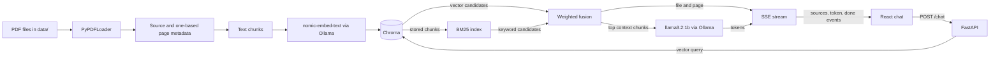

# Local RAG Search Engine

This project answers questions about PDFs using local Ollama models. FastAPI retrieves relevant chunks from Chroma, streams generated text, and sends the file and PDF page of each chunk used as context to a React chat UI.

The model and embedding requests are configured for a local Ollama service. Initial image and model downloads require network access; the application does not enforce network isolation or prove that a deployment is air-gapped.

## How it works


```mermaid
flowchart LR
    PDFs[PDF files in data/] --> Load[PyPDFLoader]
    Load --> Stamp[Source and one-based page metadata]
    Stamp --> Split[Text chunks]
    Split --> Embed[nomic-embed-text via Ollama]
    Embed --> DB[(Chroma)]
    Browser[React chat] -->|POST /chat| API[FastAPI]
    API -->|vector query| DB
    DB -->|stored chunks| BM25[BM25 index]
    DB -->|vector candidates| Fuse[Weighted fusion]
    BM25 -->|keyword candidates| Fuse
    Fuse -->|top context chunks| LLM[llama3.2:1b via Ollama]
    Fuse -->|file and page| SSE[SSE stream]
    LLM -->|tokens| SSE
    SSE -->|sources, token, done events| Browser
```

Ingestion reads the PDFs in `data/`, assigns `source` and one-based `page` metadata, splits each page, and stores the chunks in Chroma. Re-running ingestion uses stable chunk IDs, updates changed chunks, and removes chunks absent from the current PDFs. The generated `chroma_db/` directory is ignored by Git.

For a chat query, Chroma supplies vector candidates and `rank-bm25` scores the stored chunk corpus. Retrieval combines normalized vector and BM25 scores with configurable weights (both default to 0.5), ranks **chunks**, and keeps keyword-only hits. `/chat` uses up to three retrieved chunks as context. The BM25 index is currently rebuilt from Chroma for each chat request; the retrieval timings below include that work.

The API sends valid server-sent event frames over its POST response:

```text
event: sources
data: {"sources":[{"source":"zoning.pdf","page":4}]}

event: token
data: {"text":"Answer text"}

event: done
data: {}

```

An empty search sends the same event types, with an empty sources array and an explanatory token. The React client reads the response with `fetch`, `ReadableStream.getReader()`, and `TextDecoder`; it parses the events and shows the retrieved file/page list below the answer. These are citations to the chunks supplied as context, not verified sentence-level citations in generated prose. The response also includes a `Server-Timing` retrieval duration.

## Measured retrieval accuracy

The [accuracy results](benchmarks/results.md) and [raw results](benchmarks/results.json) come from a run over the five checked-in PDFs: **1,070 physical pages and 3,639 stored chunks**. The set has **20 questions**, each tied to a source, physical PDF page, and excerpt checked against that page. The [query-change record](benchmarks/results.md#query-changes) lists all 50 removed queries from the earlier mislabeled set and all 20 replacements. Labels identify one verified answer page per question; they do not claim to enumerate every relevant page.

| Method | Source hit@3 | Source hit@5 | Source MRR | Page hit@3 | Page hit@5 | Page MRR |
|---|---:|---:|---:|---:|---:|---:|
| Vector only | 95.0% | 100.0% | 0.935 | 80.0% | 90.0% | 0.739 |
| Substring keyword baseline | 80.0% | 90.0% | 0.770 | 70.0% | 75.0% | 0.610 |
| BM25 keyword only | 100.0% | 100.0% | 1.000 | 95.0% | 100.0% | 0.938 |
| Hybrid with substring | 90.0% | 95.0% | 0.885 | 75.0% | 80.0% | 0.685 |
| Hybrid with BM25 | 100.0% | 100.0% | 1.000 | 95.0% | 100.0% | 0.871 |

Here, hybrid BM25 improved source and page hit@3 over vector-only. BM25 alone had the higher page MRR (0.938 versus 0.871 for hybrid). Hit@k checks the first k retrieved chunks against either the labeled file or its labeled file/page pair; MRR uses the first matching rank. This small, excerpt-derived set does not establish performance on other documents or questions.

## Measured streaming latency

The [latency results](benchmarks/latency_results.md) and [raw samples](benchmarks/latency_results.json) record five fixed questions with two measured requests each, after one excluded warmup request. Ollama reported the loaded `llama3.2:1b` model running on a **GPU**. Times below are measured from the HTTP client; retrieval time is measured inside the API for the same request.

| Metric | Median | P90 |
|---|---:|---:|
| Retrieval | 1,327.3 ms | 1,739.6 ms |
| Time to first token | 1,638.7 ms | 2,098.5 ms |
| Full response | 1,878.2 ms | 2,414.5 ms |

The per-request table includes a slower first-token outlier. No 8B model comparison was run.

## Requirements and setup

- Python 3.13 and [uv](https://docs.astral.sh/uv/)
- Docker Desktop with NVIDIA GPU support for the supplied Compose file

```powershell
uv sync
docker compose up -d ollama
docker compose exec ollama ollama pull llama3.2:1b
docker compose exec ollama ollama pull nomic-embed-text
```

Place PDFs in `data/`, then ingest them from the host while the Compose Ollama service is running. Start the API and UI after ingestion:

```powershell
uv run python -m app.ingest
docker compose up -d --build
```

Open `http://localhost:3000`. The frontend, backend, and Ollama ports bind to `127.0.0.1` by default. The API permits the `http://localhost:3000` browser origin by default; another origin requires `FRONTEND_ORIGIN` in the backend container environment. There is no authentication or TLS, so this configuration is for local use. The supplied Compose file reserves an NVIDIA GPU; it has no automatic CPU fallback.

## Reproducing the checks

```powershell
uv run python -m unittest discover -s tests -v
uv run python -m benchmarks.accuracy_eval
uv run python -m benchmarks.latency_test
```

Run the latency command after `docker compose up -d --build`, since it calls the live `/chat` endpoint. For the frontend, run `npm ci`, `npm test`, `npm run lint`, and `npm run build` from `frontend/`.

## License

[MIT](LICENSE)
