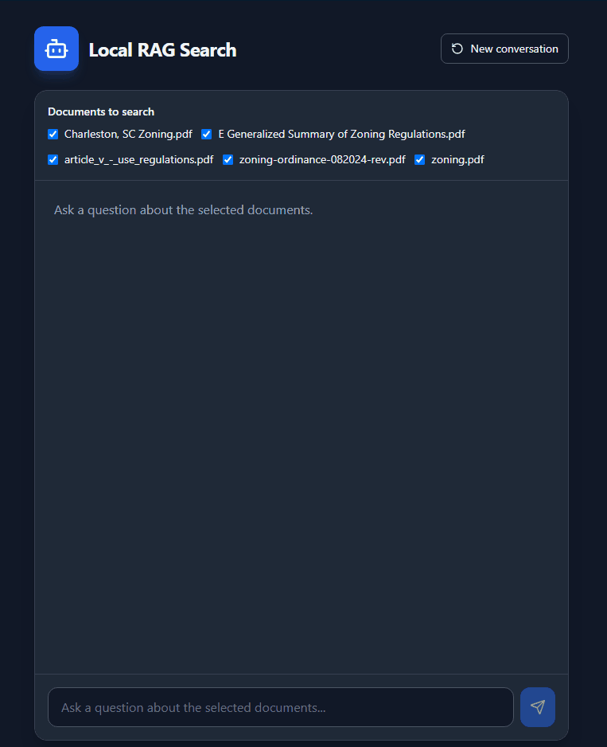

# Local RAG Search Engine

Answers questions over long PDFs with local models, checks every cited claim against its source page, and abstains when the evidence isn't there.



## Results

- **Retrieval:** page hit@3 of **89.3%** for hybrid search versus 64.3% for vector-only, on 28 excerpt-verified questions over 1,070 PDF pages. [Evaluation](docs/EVALUATION.md#measured-retrieval-accuracy)
- **Answers:** **10/12** development and **9/10** regression questions pass answer and citation screening. [Evaluation](docs/EVALUATION.md#measured-answer-quality)
- **Latency:** median full response of **1,677 ms** for answered requests (P90 2,756 ms) on an RTX 4060 Laptop GPU with `llama3.2:3b`. [Latency](docs/LATENCY.md)
- **Offline:** extraction, OCR, embeddings, retrieval, and generation all run locally, and the stack runs on a disconnected, air-gapped machine. [Air-gapped deployment](docs/AIR_GAPPED.md)

## How it works


```mermaid
flowchart LR
    PDFs[PDF files in data/] --> Load[Per-page text extraction or OCR]
    Load --> Stamp[Source, page, section, jurisdiction, version]
    Stamp --> Split[Text chunks]
    Split --> Embed[nomic-embed-text via Ollama]
    Embed --> DB[(Chroma)]
    Browser[React chat] -->|POST /chat| API[FastAPI]
    API -->|vector query| DB
    DB -->|stored chunks on first query or corpus change| BM25[Cached BM25 index]
    DB -->|vector candidates| Fuse[Weighted fusion]
    BM25 -->|keyword candidates| Fuse
    Fuse -->|up to three chunks, or one with a clear lead or section match| LLM[llama3.2:3b via Ollama]
    LLM --> Verify[Check each cited claim and evidence quote]
    BM25 --> Compare[Compare other section and document rules]
    Verify --> Compare
    Compare -->|scope, checked answer, sources| SSE[SSE response]
    SSE -->|sources, token, done or error events| Browser
    Browser -->|open cited PDF page| API
```

- **Hybrid retrieval.** Chroma vector scores and BM25 keyword scores are normalized and blended at 0.25 vector / 0.75 BM25. Section codes such as `R-2` match as whole terms.
- **Claim verification.** Each cited claim in the draft is checked against its cited passage, either by exact rule matching or by the local model returning an evidence quote found in that passage. If no draft passes, the API abstains.
- **Conflict comparison.** Differing rules on other pages in the same jurisdiction are compared with quoted evidence from both sides. When the applicable jurisdiction, district, or version is unclear, the API asks a clarifying question.
- **Streaming cited answers.** FastAPI streams status, sources, and the checked answer to a React chat over server-sent events. Each source links to its PDF page.

Details: [How it works](docs/HOW_IT_WORKS.md).

## Quick start

These steps are for a connected machine with an NVIDIA GPU and Docker Desktop with GPU support. Build the images and pull the models through the setup override:

```powershell
docker compose build
docker compose pull ollama
docker compose -f docker-compose.yml -f docker-compose.setup.yml up -d --no-build --pull never ollama
docker compose -f docker-compose.yml -f docker-compose.setup.yml exec ollama ollama pull llama3.2:3b
docker compose -f docker-compose.yml -f docker-compose.setup.yml exec ollama ollama pull nomic-embed-text
docker compose -f docker-compose.yml -f docker-compose.setup.yml down
```

Place PDFs in `data/`, then start and ingest:

```powershell
docker compose up -d --no-build --pull never
docker compose exec backend uv run --offline python -m app.ingest
```

Open `http://localhost:3000`. For a disconnected target, see [Air-gapped deployment](docs/AIR_GAPPED.md).

## Tech stack

Python 3.13, FastAPI, Chroma, rank-bm25, PyMuPDF, RapidOCR, Ollama (`llama3.2:3b`, `nomic-embed-text`), React with Vite, and Docker Compose.

## Limitations

- **Small evaluation sets.** 28 retrieval questions, 12 development and 10 regression answer questions, over five PDFs. The final holdout has not been run.
- **3B answering model.** Checks reduce unsupported output but still depend partly on a small model. It can cite a different page that states a similar rule, and the conflict check can flag different tiers of the same use as conflicting.
- **Sequential claim checks.** Claim checks and conflict comparison run one after another before the answer is sent, so requests that need citation repair take longer.

## Reproducing the checks

```powershell
uv run python -m unittest discover -s tests -v
uv run python -m benchmarks.accuracy_eval
uv run python -m benchmarks.answer_eval --dataset development_queries.json --output-prefix development_answer_results
uv run python -m benchmarks.answer_eval --dataset regression_queries.json --output-prefix regression_answer_results
uv run python -m benchmarks.citation_support --calibrate
uv run python -m benchmarks.answer_eval --dataset coverage_development_queries.json --output-prefix coverage_development_answer_results
uv run python -m benchmarks.fixture_eval
uv run python -m benchmarks.answer_eval --dataset heldout_queries.json --output-prefix heldout_answer_results --final-holdout  # once; see docs/EVALUATION.md
uv run python -m benchmarks.latency_test
```

Run the answer and latency commands after starting the normal stack, since they call the live `/chat` endpoint. Answer evaluations judge citation support with `qwen2.5:7b` (pull it during the connected setup stage with `docker compose -f docker-compose.yml -f docker-compose.setup.yml exec ollama ollama pull qwen2.5:7b`, or set `BENCH_JUDGE_MODEL`); `--no-support` skips it. For the frontend, run `npm ci`, `npm test`, `npm run lint`, and `npm run build` from `frontend/`.

## License

[MIT](LICENSE)
